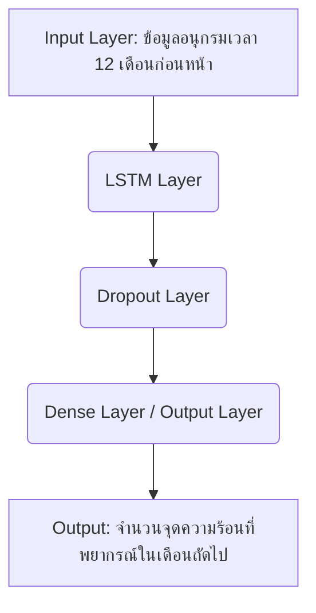

## โฟลว์การทำงาน (Workflow)

```mermaid
%%{init: {'theme':'default','securityLevel':'loose','fontFamily':'"Noto Sans Thai", sans-serif'}}%%
flowchart TD
    A["เริ่มต้น"] --> B("1. การรวบรวมข้อมูล")
    B --> B1["รวบรวมข้อมูลอนุกรมเวลาจาก Google Earth Engine (GEE)"]
    B1 --> B2["กำหนดพื้นที่ศึกษา: จังหวัดเชียงใหม่"]
    B2 --> B3["ข้อมูลที่รวบรวม: ค่าเฉลี่ย NDVI รายเดือน (MODIS) และจำนวนจุดความร้อนรายเดือน (FIRMS)"]
    B3 --> C("2. การเตรียมข้อมูล")
    C --> C1["รวมข้อมูล NDVI และจำนวนจุดความร้อนใน DataFrame เดียวกัน"]
    C1 --> C2["ปรับมาตราส่วนข้อมูล (Data Scaling) ด้วย MinMaxScaler (ช่วง 0 ถึง 1)"]
    C2 --> C3["สร้างชุดข้อมูลสำหรับสอน (Training Sequences) โดยใช้ข้อมูล 12 เดือนก่อนหน้า (Time Step = 12) เพื่อพยากรณ์เดือนถัดไป"]
    C3 --> D("3. การสร้างและฝึกสอนแบบจำลอง")
    D --> D1["พัฒนาแบบจำลอง Long Short-Term Memory (LSTM) ด้วย Keras และ TensorFlow"]
    D1 --> D2["กำหนดสถาปัตยกรรม: LSTM Layer, Dropout Layer, Dense Layer"]
    D2 --> D3["แบ่งข้อมูลเป็น Training Set (80%) และ Testing Set (20%)"]
    D3 --> D4["ฝึกสอนด้วย Loss: MSE และ Optimizer: Adam"]
    D4 --> D5["ใช้เทคนิค EarlyStopping เพื่อป้องกัน Overfitting"]
    D5 --> E("4. การประเมินประสิทธิภาพ")
    E --> E1["ประเมินบนชุดทดสอบ (Test set)"]
    E1 --> E2["ตัวชี้วัด: MAE, MSE, RMSE, R²"]
    E2 --> F("5. การพยากรณ์อนาคต")
    F --> F1["พยากรณ์จำนวนจุดความร้อนล่วงหน้า 12 เดือน"]
    F1 --> F2["ช่วงเวลาพยากรณ์: กันยายน 2568 – สิงหาคม 2569"]
    F2 --> G["สิ้นสุด"]
```

## Flow ของ สถาปัตยกรรม LSTM

```mermaid
graph TD
    A[Input Layer: ข้อมูลอนุกรมเวลา 12 เดือนก่อนหน้า] --> B(LSTM Layer)
    B --> C(Dropout Layer)
    C --> D(Dense Layer / Output Layer)
    D --> E[Output: จำนวนจุดความร้อนที่พยากรณ์ในเดือนถัดไป]
```