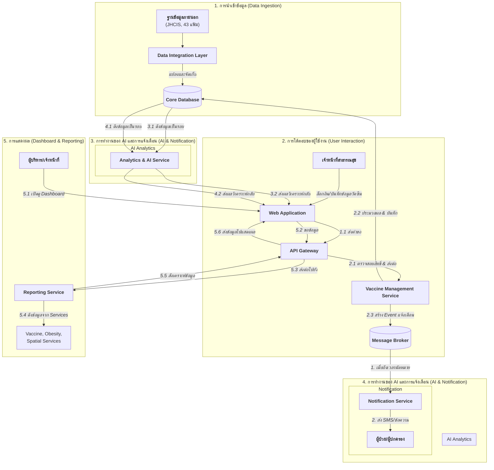

```mermaid
graph TD
    subgraph "1. การนำเข้าข้อมูล (Data Ingestion)"
        direction LR
        ExternalDB["<b>ฐานข้อมูลภายนอก</b><br/>(JHCIS, 43 แฟ้ม)"] --> DIL["<b>Data Integration Layer</b>"]
        DIL -- "<i>แปลงและจัดเก็บ</i>" --> CoreDB[("<b>Core Database</b>")]
    end

    subgraph "2. การโต้ตอบของผู้ใช้งาน (User Interaction)"
        direction TB
        User["<b>เจ้าหน้าที่สาธารณสุข</b>"] -- "<i>ล็อกอิน/บันทึกข้อมูลวัคซีน</i>" --> Frontend["<b>Web Application</b>"]
        Frontend -- "<i>1.1 ส่งคำขอ</i>" --> APIGW["<b>API Gateway</b>"]
        APIGW -- "<i>2.1 ตรวจสอบสิทธิ์ & ส่งต่อ</i>" --> VMS["<b>Vaccine Management Service</b>"]
        VMS -- "<i>2.2 ประมวลผล & บันทึก</i>" --> CoreDB
        VMS -- "<i>2.3 สร้าง Event แจ้งเตือน</i>" --> MB[("<b>Message Broker</b>")]
    end

    subgraph "3. การทำงานของ AI และการแจ้งเตือน (AI & Notification)"
        direction TB
        subgraph "AI Analytics"
            CoreDB -- "<i>3.1 ดึงข้อมูลเป็นรอบ</i>" --> AIS["<b>Analytics & AI Service</b>"]
            AIS -- "<i>3.2 ส่งผลวิเคราะห์กลับ</i>" --> Frontend
        end
    end

    subgraph "4. การทำงานของ AI และการแจ้งเตือน (AI & Notification)"
        direction TB
        subgraph "AI Analytics"
            CoreDB -- "<i>4.1 ดึงข้อมูลเป็นรอบ</i>" --> AIS["<b>Analytics & AI Service</b>"]
            AIS -- "<i>4.2 ส่งผลวิเคราะห์กลับ</i>" --> Frontend
        end

        subgraph "Notification"
             MB -- "<i>1. เมื่อถึงเวลานัดหมาย</i>" --> NS["<b>Notification Service</b>"]
             NS -- "<i>2. ส่ง SMS/ข้อความ</i>" --> Patient["<b>ผู้ป่วย/ผู้ปกครอง</b>"]
        end
    end

    subgraph "5. การแสดงผล (Dashboard & Reporting)"
        direction TB
        Admin["<b>ผู้บริหาร/เจ้าหน้าที่</b>"] -- "<i>5.1 เปิดดู Dashboard</i>" --> Frontend
        Frontend -- "<i>5.2 ขอข้อมูล</i>" --> APIGW
        APIGW -- "<i>5.3 ส่งต่อไปยัง</i>" --> RS["<b>Reporting Service</b>"]
        RS -- "<i>5.4 ดึงข้อมูลจาก Services</i>" --> OtherServices["Vaccine, Obesity,<br/>Spatial Services"]
        RS -- "<i>5.5 สังเคราะห์ข้อมูล</i>" --> APIGW
        APIGW -- "<i>5.6 ส่งข้อมูลไปแสดงผล</i>" --> Frontend
    end
```